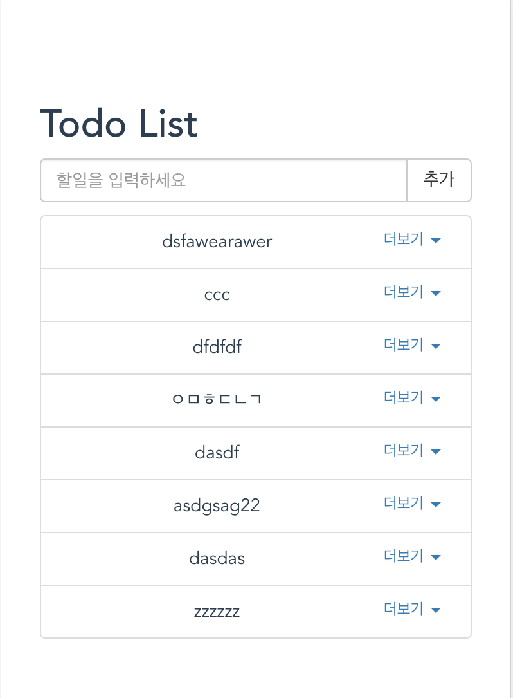

# Vue.js playgrounds

## todos-client


---

## Build Setup

``` bash
# install dependencies
npm install

# serve with hot reload at localhost:8080
npm run dev

# build for production with minification
npm run build

# build for production and view the bundle analyzer report
npm run build --report

# application is running here
http://localhost:8080/#/todos

# install axios
npm install axios --save-dev
```

For a detailed explanation on how things work, check out the [guide](http://vuejs-templates.github.io/webpack/) and [docs for vue-loader](http://vuejs.github.io/vue-loader).

---
## Memo
### 선언적 렌더링
>+ Vue.js의 핵심, 간단한 template구문을 사용해 선언적으로 DOM에 데이터를 렌더링
>+ 데이터가 리엑티브하다(반응형). 콘솔에서 데이터를 바꾸면 바뀐 값이 렌더링 된다.

### 프로젝트 생성
```bash
npm install vue-cli -g
```

### webpack 템플릿
```bash
vue init webpack todos-client
```

### Sources (src)
>+ components
>> Vue.js에서 사용하는 Vue라는 컴포넌트들을 생성, 구현
>+ router/index.js
>> Vue는 라우팅 기능을 제공하는 Vue Router가 있어, 이를 가지고 서버에 request를 보내지 않아도 새로운 페이지로 이동가능하도록 도와줌
>+ App.vue
>> 프로젝트가 다루는 컴포넌트가 표시되는 Root 컴포넌트
>+ main.js
>> 프로젝트의 Base js, 전역 설정을 하려면 이를 이용

### Vue's Component
> Consist of
>+ temaplate
>+ script
>+ style

>컴포넌트는 Vue의 대표적 기능.
>재사용 가능한 코드를 캡슐화하는데 도움이 됨.
--- 

### Reference
[VueJs 빠른시작 - Todo 만들기](https://blog.storyg.co/vue-js-posts/todos-tutorial)